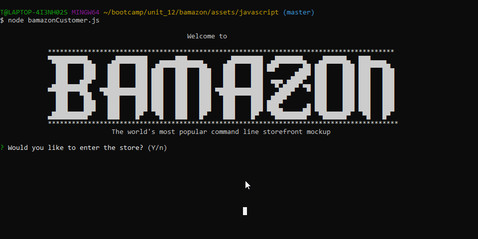
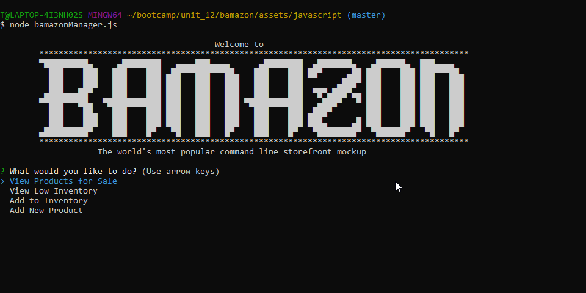
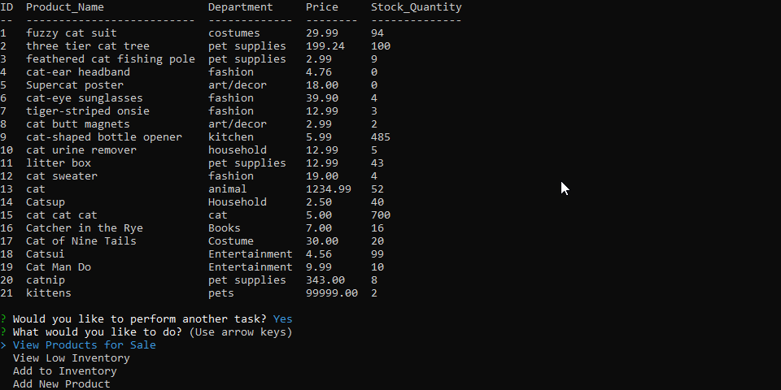
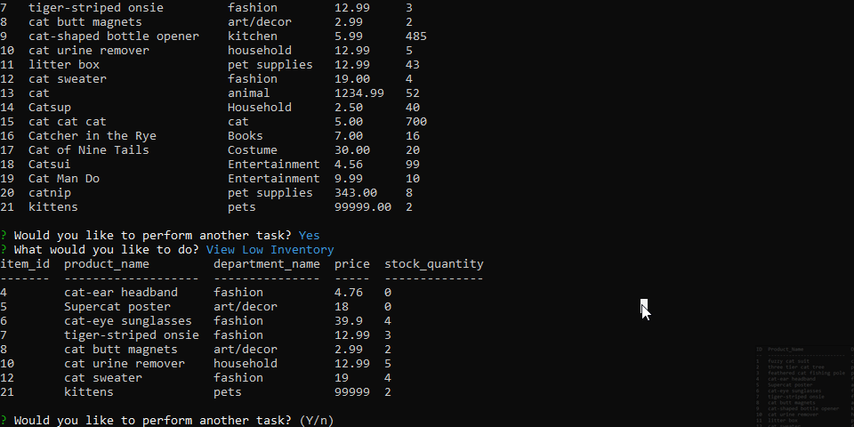
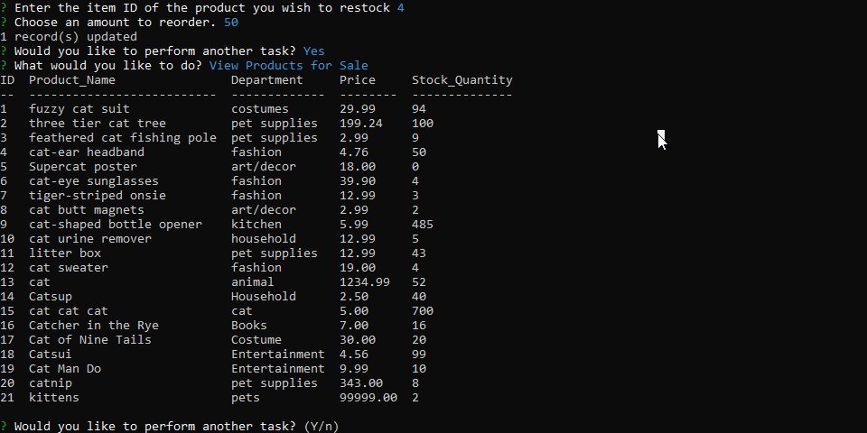

# bamazon-cli-app

Command line storefront application 

[Features](#features) | [Usage](#usage)  

# features

Bamazon can be run either in customer mode or manager mode:
 - [bamazon_customer](#Customer_Interface)
 - [bamazon_manager](#Manager_Interface)

# usage
### Customer_Interface
Customers experience a simple, intuitive ordering interface that makes shopping easy, convenient and irreversable!  User inputs are validated and sanitized so nothing yucky can get into your database!  The following video shows a customer making an order correctly, as well as some of the common mistakes that Bamazon will catch. 

### Manager_Interface
Manager use allows authorized users to easily check inventory, see what is running low and reorder quickly and simply.

#### View Inventory
Inventory view offers an easy to read, tabular view of every product in the shop and the product details such as amount in inventory.  From here the user can choose to perform another task which will take them back to the main menu.

#### View Low Inventory
Low inventory view shows a table containing any product whose inventory amount is 5 or lower.  This makes knowing what to reorder super simple!

#### Reorder Products
The user can easily navigate from the low inventory screen to the ordering menu by choosing 'Add to Inventory' back at the main menu. 

#### Add New Product
A simple series of questions walks the user through the process of adding a new product to the inventory.  User inputs are validated and clean making it hakuna matata. 

# author
Tierra Farris

